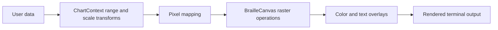

# txtplot Architecture

This document describes the current implementation architecture of `txtplot`: the crate layout, rendering pipeline, chart layer, and the extension seams that should remain stable as the project grows.

## Scope

This is the implementation contract for module ownership, data flow, and extension boundaries. Project principles live in `CONSTITUTION.md`. User-facing usage patterns live in `GUIDE.md`.

## Source Layout

The repository is intentionally compact, but the core modules are now split into focused internal files.

| Path | Responsibility |
|------|----------------|
| `src/lib.rs` | Crate-root wiring and public facade |
| `src/canvas/mod.rs` | `BrailleCanvas`, `ColorBlend`, and shared low-level buffer helpers |
| `src/canvas/*.rs` | Canvas composition, pixel operations, clipping, primitives, rendering, tests |
| `src/charts/mod.rs` | `ChartContext`, `AxisScale`, and shared plot geometry helpers |
| `src/charts/*.rs` | Range helpers, overlays, axes, chart series, tests |
| `src/prelude.rs` | Convenient downstream re-exports |
| `examples/` | End-to-end examples and visual demos |
| `benches/` | Performance benchmarks |
| `scripts/` | Repo helper scripts |

## Public Surface Model

The public API is intentionally split into two layers:

| Layer | Primary Types | Role |
|------|---------------|------|
| Raster layer | `BrailleCanvas`, `ColorBlend` | Pixel-space drawing, composition, and output |
| Plotting layer | `ChartContext`, `AxisScale` | Data-space mapping, range handling, axes, charts |

`src/lib.rs` exports those types directly. `src/prelude.rs` exists as the ergonomic import path for downstream consumers.

## Core Data Structures

### `BrailleCanvas`

`BrailleCanvas` is the low-level rendering substrate.

- Stores one byte mask per terminal cell for Braille dots
- Stores optional foreground colors per cell
- Stores an optional text overlay layer per cell
- Tracks plot insets in pixel coordinates
- Owns composition helpers such as overlay and merge behavior

Current design goals:

1. Flat contiguous buffers
2. Minimal branching on the hot path
3. Explicit pixel coordinate conversion
4. Rendering that can target a `String` or any `fmt::Write`

### `ChartContext`

`ChartContext` is the higher-level plotting adapter.

- Owns the `BrailleCanvas`
- Tracks axis scales (`Linear`, `Log10`)
- Computes auto-ranges and transformed ranges
- Maps floating-point domain coordinates into canvas pixels
- Manages axis decorations and chart-level composition through a background mask

`ChartContext` should remain the only place where data-space concerns like ticks, ranges, and scale transforms are centralized.

## Rendering Pipeline

Typical flow:

The important boundary is between data-space and pixel-space:

- `ChartContext` decides where data should land
- `BrailleCanvas` decides how that landing is rasterized into Braille cells

## Composition Model

The current composition model uses three parallel concerns at the cell level:

1. Braille mask bits for dot occupancy
2. Optional foreground color
3. Optional text overlay

This enables:

- layered chart drawing
- text annotations without losing raster data unexpectedly
- selective preservation of background structure via the background mask

If a future extension needs richer styling, it should still preserve a single canonical composition path instead of introducing a separate renderer.

## Coordinate Systems

Two coordinate modes are part of the current contract:

| Mode | Origin | Primary Use |
|------|--------|-------------|
| Cartesian | Bottom-left | Plots, math, charts |
| Screen | Top-left | UI-style drawing, sprites, demos |

Boundary rule:

- Coordinate conversion belongs in the canvas/chart APIs themselves, not in ad hoc caller-side wrappers.

## Extension Seams

### Safe extensions

- New pixel primitives in `BrailleCanvas`
- New chart helpers in `ChartContext`
- New scale variants in `AxisScale`
- New examples under `examples/`
- New benchmarks under `benches/`

### Changes that should stay coordinated

- Any new public type should be reviewed through `src/lib.rs`, `src/prelude.rs`, and `README.md`.
- Any new rendering strategy should be evaluated against existing buffer, overlay, and clipping assumptions.
- If the crate grows beyond the current core module layout, update this document and keep the boundary between raster and chart logic explicit.

## Performance Contracts

Performance is a first-order design constraint.

1. Prefer flat buffers over nested cell objects.
2. Keep per-frame allocation optional, not mandatory.
3. Keep clipping and coordinate normalization centralized.
4. Treat examples and demos as consumers of the same hot path, not special alternate implementations.

## Extension Decision Rules

Use these rules when deciding where code belongs:

- If it operates on pixels, masks, colors, or text cells, it belongs somewhere under `src/canvas/`.
- If it operates on `f64` data, ranges, scales, ticks, or chart presentation, it belongs somewhere under `src/charts/`.
- If it only improves import ergonomics, it belongs in `src/prelude.rs`.
- If it changes the user-visible crate contract, it must be reflected in `src/lib.rs` and documented.

## Pluggable Cell Renderers Checklist

This is the planned implementation path for renderer-pluggable terminal cells such as Braille, Quadrants, and HalfBlocks.

### Design Constraints

- Keep Braille as the default renderer and benchmark baseline.
- Use static dispatch in the hot path: prefer `CellCanvas<R>` over trait objects inside per-pixel loops.
- Treat renderer choice as a cell encoding concern, not a charting concern.
- Do not market every renderer as "higher resolution". Braille remains the densest built-in layout at `2x4` sub-pixels per cell.
- Assume HalfBlocks will require a richer color model than the current single-foreground-color-per-cell design.

### Implementation Checklist

- [ ] Introduce a `CellRenderer` trait that defines cell geometry and encoding hooks.
  It should own things like `CELL_WIDTH`, `CELL_HEIGHT`, sub-pixel set/unset behavior, and cell-to-terminal output.
- [ ] Refactor the raster core into a generic `CellCanvas<R: CellRenderer>`.
  Move Braille-specific mask math and glyph emission out of the core canvas and into a dedicated renderer implementation.
- [ ] Preserve the current public default with compatibility aliases or wrappers.
  `BrailleCanvas` should remain the ergonomic default even if it becomes `type BrailleCanvas = CellCanvas<BrailleRenderer>`.
- [ ] Generalize `ChartContext` over the renderer type.
  Plotting code should work with alternate cell renderers without duplicating axis, range, or series logic.
- [ ] Implement `QuadrantRenderer` first.
  It is the lowest-risk validation step because it fits the current cell-color model more closely than HalfBlocks.
- [ ] Extend cell state for `HalfBlockRenderer`.
  This likely means foreground/background color support or another richer per-cell reduction model instead of the current single optional foreground color.
- [ ] Keep runtime renderer selection above the hot path.
  If runtime switching is added, choose the renderer at construction boundaries rather than paying dynamic-dispatch cost for every pixel write.
- [ ] Add renderer-specific tests, benchmarks, examples, and docs.
  Include pixel-dimension tests, render goldens, compatibility coverage for existing APIs, and performance comparisons against Braille.

### Suggested Rollout Order

1. Add `CellRenderer` and `CellCanvas<R>` with Braille only and no behavior change.
2. Genericize `ChartContext` while keeping Braille as the default type parameter.
3. Add `QuadrantRenderer` and validate the design.
4. Rework cell color/state as needed for `HalfBlockRenderer`.
5. Add runtime selection helpers, examples, benchmarks, and migration docs.
