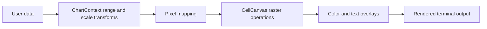

# txtplot Architecture

This document describes the current implementation architecture of `txtplot`: the crate layout, rendering pipeline, chart layer, and the extension seams that should remain stable as the project grows.

## Scope

This is the implementation contract for module ownership, data flow, extension boundaries, and the primary planning document for architectural slices. Project principles live in `CONSTITUTION.md`. User-facing usage patterns live in `GUIDE.md`.

When a refactor or feature slice changes architectural priorities, update this file first. Short-term work should be tracked here, not scattered across commit messages or example-only notes.

## Source Layout

The repository is intentionally compact, but the core modules are now split into focused internal files.

| Path | Responsibility |
|------|----------------|
| `src/lib.rs` | Crate-root wiring and public facade |
| `src/canvas/mod.rs` | `BrailleCanvas`, `ColorBlend`, and shared low-level buffer helpers |
| `src/canvas/*.rs` | Canvas composition, pixel operations, clipping, primitives, UI helpers, rendering, tests |
| `src/charts/mod.rs` | `ChartContext`, `AxisScale`, and shared plot geometry helpers |
| `src/charts/*.rs` | Range helpers, overlays, axes, chart series, tests |
| `src/three_d.rs` | Reusable 3D math, projection, z-buffer, and mesh helpers built on the raster layer |
| `src/prelude.rs` | Convenient downstream re-exports |
| `examples/` | End-to-end examples and visual demos |
| `benches/` | Performance benchmarks |
| `scripts/` | Repo helper scripts |

## Public Surface Model

The public API is intentionally split into two layers:

| Layer | Primary Types | Role |
|------|---------------|------|
| Raster layer | `CellCanvas<R>`, `ColorBlend`, `txtplot::three_d` | Pixel-space drawing, composition, output, and screen-space 3D helpers |
| Plotting layer | `CellChartContext<R>`, `AxisScale` | Data-space mapping, range handling, axes, charts |

`src/lib.rs` exports those types directly. `src/prelude.rs` exists as the ergonomic import path for downstream consumers. Compatibility aliases such as `BrailleCanvas`, `HalfBlockCanvas`, `QuadrantCanvas`, and `ChartContext` remain the ergonomic defaults.

## Core Data Structures

### `CellCanvas<R>`

`CellCanvas<R>` is the low-level rendering substrate. Renderer aliases such as `BrailleCanvas`, `HalfBlockCanvas`, and `QuadrantCanvas` are compatibility and ergonomics layers over the same core structure.

- Stores one renderer-specific cell state value per terminal cell
- Stores optional foreground colors per cell
- Stores optional background colors per cell
- Stores an optional text overlay layer per cell
- Tracks plot insets in pixel coordinates
- Owns composition helpers such as overlay and merge behavior
- Exposes cell-space text, label, and panel helpers for HUD work

Current design goals:

1. Flat contiguous buffers
2. Minimal branching on the hot path
3. Explicit pixel coordinate conversion
4. Rendering that can target a `String` or any `fmt::Write`

### `CellChartContext<R>`

`CellChartContext<R>` is the higher-level plotting adapter. `ChartContext` remains the default Braille alias for the common plotting path.

- Owns the `CellCanvas<R>`
- Tracks axis scales (`Linear`, `Log10`)
- Computes auto-ranges and transformed ranges
- Maps floating-point domain coordinates into canvas pixels
- Manages axis decorations and chart-level composition through a background mask

`CellChartContext<R>` should remain the only place where data-space concerns like ticks, ranges, and scale transforms are centralized.

## Rendering Pipeline

Typical flow:

The important boundary is between data-space and pixel-space:

- `CellChartContext<R>` decides where data should land
- `CellCanvas<R>` decides how that landing is rasterized into renderer-specific cells

## Composition Model

The current composition model uses four parallel concerns at the cell level:

1. Renderer-specific cell occupancy or mask state
2. Optional foreground color
3. Optional background color
4. Optional text overlay

This enables:

- layered chart drawing
- text annotations without losing raster data unexpectedly
- selective preservation of background structure via the background mask

If a future extension needs richer styling, it should still preserve a single canonical composition path instead of introducing a separate renderer.

## Coordinate Systems

Two coordinate modes are part of the current contract:

| Mode | Origin | Primary Use |
|------|--------|-------------|
| Cartesian | Bottom-left | Plots, math, charts |
| Screen | Top-left | UI-style drawing, sprites, demos |

Boundary rule:

- Coordinate conversion belongs in the canvas/chart APIs themselves, not in ad hoc caller-side wrappers.

## Extension Seams

### Safe extensions

- New pixel primitives in `BrailleCanvas`
- New chart helpers in `ChartContext`
- New scale variants in `AxisScale`
- New examples under `examples/`
- New benchmarks under `benches/`

### Changes that should stay coordinated

- Any new public type should be reviewed through `src/lib.rs`, `src/prelude.rs`, and `README.md`.
- Any new rendering strategy should be evaluated against existing buffer, overlay, and clipping assumptions.
- If the crate grows beyond the current core module layout, update this document and keep the boundary between raster and chart logic explicit.

## Performance Contracts

Performance is a first-order design constraint.

1. Prefer flat buffers over nested cell objects.
2. Keep per-frame allocation optional, not mandatory.
3. Keep clipping and coordinate normalization centralized.
4. Treat examples and demos as consumers of the same hot path, not special alternate implementations.

## Extension Decision Rules

Use these rules when deciding where code belongs:

- If it operates on pixels, masks, colors, or text cells, it belongs somewhere under `src/canvas/`.
- If it operates on `f64` data, ranges, scales, ticks, or chart presentation, it belongs somewhere under `src/charts/`.
- If it operates on reusable world-space vectors, projection, z-buffers, or mesh generation while still targeting screen-space raster output, it belongs in `src/three_d.rs`.
- If it only improves import ergonomics, it belongs in `src/prelude.rs`.
- If it changes the user-visible crate contract, it must be reflected in `src/lib.rs` and documented.

## Planning Status

This section is the source of truth for the next architectural slices. Keep it ordered, implementation-oriented, and update statuses when slices land.

### Completed Foundations

- [x] Split the core crate into focused canvas and chart submodules.
- [x] Generalize the raster core around `CellCanvas<R>` and `CellRenderer`.
- [x] Preserve ergonomic aliases for Braille while adding HalfBlock and Quadrant renderers.
- [x] Generalize the chart layer around `CellChartContext<R>`.
- [x] Add background-aware cell styling for richer renderer behavior.
- [x] Add cell-space HUD helpers for panels, labels, and top-left screen text.
- [x] Promote reusable 3D math, projection, and z-buffer helpers into `txtplot::three_d`.

### Renderer Program Status

The renderer architecture is largely complete. The remaining renderer work is:

- [x] Runtime renderer selection helpers.
  `RendererKind` and `with_renderer!` now allow applications to choose a renderer from runtime input while still constructing concrete generic types inside the selected branch.
- [x] Renderer benchmark and golden coverage.
  `canvas_benchmark` now measures chart-heavy and raster-heavy renderer scenes across Braille, HalfBlock, and Quadrant, and the test suite includes stable renderer comparison snapshots for both chart and raster output.

### Active Slice Roadmap

1. Chart presentation layer improvements.
   Goal: close the gap between “plotting library” and “terminal dashboard toolkit”.
   Status: [Completed] Added automatic legend box, anchored annotations, and opaque panel integration.
   Scope: `legend()`, `anchored_text()`, and `ChartAnchor` enable more professional chart layouts.

2. Reusable 3D interaction helpers.
   Goal: promote the shared overlap that still lives only in examples when it becomes clearly generic.
   Likely candidates: picking/depth-id buffers, orbit camera helpers, or camera-control utilities.
   Non-goal: shipping a full retained-mode scene graph.

3. Matrix and field-style plotting.
   Goal: broaden the analytical surface beyond line/scatter/bar/pie into heatmaps, image-like plots, and related raster-backed analytical views.
   Status: [Completed] Added `heatmap()`, `ColorScale` trait, and `Viridis`/`Greyscale` palettes with advanced Braille dithering.
